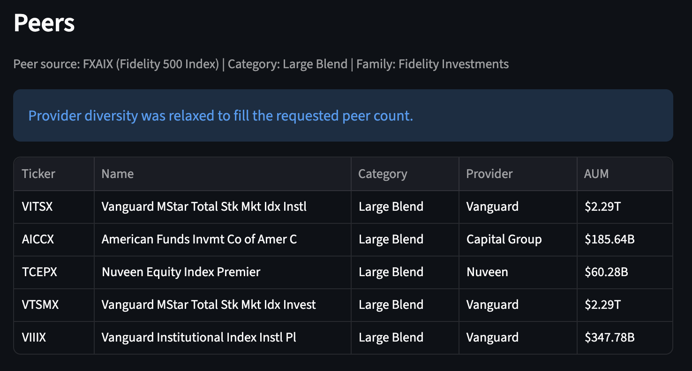

# TO DO

## Latest Aug 22

Working on auto peer selection.  note this one is illustrative:
Peer source: FXAIX (Fidelity 500 Index) | Category: Large Blend | Family: Fidelity Investments -- Provider diversity was relaxed to fill the requested peer count.



[Table](./Peer Table 2026-08-22.csv)

Where you can see how "Vanguard MStar Total Stk Mkt Idx Instl Large Blend Vanguard \$2.29T" is similar to the "Vanguard MStar Total Stk Mkt Idx Invest Large Blend Vanguard \$2.29T" and they need not both be listed while seeing that the "Vanguard Institutional Index Instl Pl Large Blend Vanguard \$347.78B" as something different.


And notice with 6 selected:


So there were diverse selections available.


## Older

### in no particular order

1. Rewrite README.md to reflect current app features functions and operation, as well as providing hints about what to do with it.

2. Personalize individual user experiences:
   
   1. Study the code at https://github.com/Sven-Bo/streamlit-sales-dashboard-with-userauthentication-database.git
   2. Review the demo app
   3. Add to the stock app a login page and database storage for the saved configurations
   4. Customize output display to the saved user-specific configuration including generally restoring the last used configuration when the user logs in.

## Some Claude suggestions:

New, significant finding: the shared ticker cache never backfills the start of a date range
This is the most important thing the new file reveals. In `fetch_history_with_cache`:

```python
if cached_entry.last_record_date is not None:
    if cached_entry.last_record_date >= requested_end:
        filtered = cached_history.loc[(cached_history.index >= requested_start) & (cached_history.index <= requested_end)]
        return filtered, {"used_saved_cache": True, "refreshed_cache": False}
    refresh_start = max(requested_start, (cached_entry.last_record_date + pd.Timedelta(days=1)).normalize())
```

This only checks that the cache is fresh enough at the end of the range (`last_record_date >= requested_end`). It never checks whether the cache actually reaches back to `requested_start`. 

If it's "fresh" at the end, it just filters whatever's already cached — it never downloads further back, no matter how short the cached history actually is.

Because `pgStocks_ticker_cache.db` is a single shared database used by every user and every configuration (it's not scoped per-user or per-period), this isn't just a same-session quirk — it can also happen across totally unrelated sessions: if any user has ever looked at a ticker with a short period, the next user who requests a longer period for that same ticker gets silently truncated data. This also quietly defeats the backfill logic `pgStocks.py`'s own `fetch_prices_with_cache` tries to do (`if request_start < cache_start: earlier_prices = _download_close_prices(...)`) — that call routes through the same buggy function, so the intended backfill can itself come back truncated.

`test_ticker_cache.py` only tests forward-appending scenarios (`test_upsert_updates_history_and_latest_record_date`), so this gap isn't caught by the existing test suite — worth adding a test that requests a wider start than what's cached.

### Corrections/updates to my earlier notes

+ `refresh_ticker_history` unused import — still true for pgStocks.py (it never calls it directly), but it's not orphaned in the codebase overall: ticker_cache.py uses it internally (fetch_history_with_cache calls it twice). So it's just an unnecessary import line in pgStocks.py, not dead functionality.
+ `price_fetch_info["used_saved_cache"]`/`["refreshed_cache"]` unused — this is worse than I described. It's not just `pgStocks.py`'s own top-level flags going unread; `fetch_history_with_cache` already computes this per symbol and returns it, but `_download_close_prices` throws it away immediately (`history_frame, info = fetch_history_with_cache(...)` — `info` is never touched again). `pgStocks.py` then re-derives its own coarser, timestamp-based cache messaging one layer up instead of using the accurate per-ticker signal that was already computed for it. Related: when a fresh download for an uncached symbol returns None (failed/empty), `refresh_ticker_history(symbol, None, ...)` is still called, and the function still reports `refreshed_cache: True` even though nothing was actually written to the cache (`should_update_history` short-circuits to a no-op when `history_frame is None`). Minor mislabeling, but adds noise to a signal that's already unused.
+ `_ensure_price_frame` orphan in `pgStocks.py` — confirmed, and now I can say precisely what happened: `ticker_cache.py` has its own working equivalent, `_ensure_history_frame`, which is actually used (lines 114, 271). `pgStocks.py`'s copy is a duplicate that got abandoned after the refactor to route through `ticker_cache`.
+ `datetime.utcnow()` deprecation — also present in `ticker_cache.py` (`dt.datetime.utcnow` as the default for `created_at`/`updated_at` on both models), so it's two files with the same eventual issue, not one.

#### New minor items from `ticker_cache.py`

+ No-op self-assignment block. When `upsert_ticker_cache_entry` is called with no metadata (or empty), it does this instead of just doing nothing:

```python
  else:
      metadata_record.metadata_json = metadata_record.metadata_json
      metadata_record.name = metadata_record.name
      ...  # same pattern for every field
```

Harmless, but it's dead code — assigning a field to itself changes nothing. Was probably meant to be an explicit "leave unchanged" comment and got left as executable code.

+ Possible `yf.download` column-shape mismatch (unconfirmed). `_download_history_frame` checks `if "Close" in frame.columns` to normalize column names. Depending on the installed yfinance version, a single-ticker yf.download() call can return a MultiIndex-columned frame (e.g., ('Close', 'AAPL')), in which case the plain-string membership check would miss and fall through to frame.iloc[:, :1] — silently grabbing whatever the first column happens to be (possibly Open, not Close) and mislabeling it "Adj Close". I don't have your requirements.txt/pinned yfinance version to confirm this actually triggers, so treat it as "worth a quick manual check," not a confirmed bug.
+ Duplicated serialization logic. `pgStocks.py`'s `_serialize_price_frame`/`_deserialize_price_frame` and `ticker_cache.py`'s `_serialize_history_frame`/`_deserialize_history_frame` implement the same index/columns/data JSON scheme independently. Not a bug, but a maintenance smell — a schema tweak in one place won't propagate to the other.
  README gap. The README documents only the user-accounts DB (pgStocks_users.db) location, not the separate shared pgStocks_ticker_cache.db that ticker_cache.py creates in the same config directory. Given the bug above is a direct consequence of that cache being shared and undocumented, it's worth adding a line about it (and maybe a way to clear/reset it).

Everything else from before still stands unchanged
Empty "Baseline Index" crash, peer_lookup_note never displayed, manual peers not excluded before auto-peer discovery runs, the static/global password salt, unclosed matplotlib figures, and the unused local widget variables (market_input, peer_source_input, manual_peer_input, risk_free_rate_pct) — none of these touch ticker_cache.py, so my original assessment holds as-is.

## New Nores for after Aug 22:
